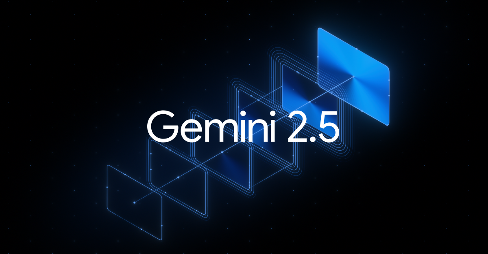
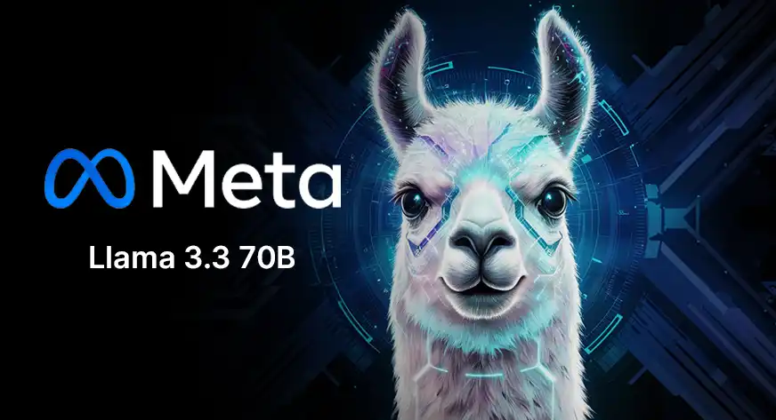

# 🧠 Mora AI – Context-Aware Corporate Knowledge Brain
---

## 🚀 Overview

**Mora AI** is a production-grade **RAG (Retrieval Augmented Generation) system** that transforms corporate SOP PDFs into an intelligent, searchable knowledge assistant.
<p align="center">
  
</p>

> Ask questions. Get accurate answers. With exact source citations.

---

## ✨ Core Features

- 📄 **PDF Upload & Parsing**
- 🧠 **Semantic Search (MongoDB Vector Search)**
- 🤖 **Multi-LLM Support**
  - *Gemini 2.5 Flash*
    <p align="center">
	    
    </p>
  - *Groq (LLaMA 3.1)*
    <p align="center">
      
    </p>
- 🎯 **Source Citation + Highlight System**
- 💬 **Chat Memory Persistence**
- 📊 **User & Admin Analytics**
- 👑 **Role-Based Access Control**
- ⚡ **Streaming Responses (SSE Ready)**

---

## 🧠 Architecture

```text
PDF → Chunk → Embedding → MongoDB Vector Search
          ↓
      Query → Retrieve Context → LLM → Answer + Sources
```

---


**🛠️ Tech Stack**
| **Layer**           | **Technology**                             |
| ------------------- | ------------------------------------------ |
|     Backend         | Node.js + Express                          |
|     Database        | MongoDB Atlas (Vector Search)              |
|     Embeddings      | Xenova Transformers                        |
|     LLM             | Gemini 2.5 Flash & Groq (LLaMA 3.1)        |
|     Auth            | JWT + OTP (Nodemailer)                     |
|     File Upload     | Multer                                     |
|     PDF Parsing     | pdfjs-dist                                 |


---

**📂 Folder Structure**
```text
src/
├── config/
├── controllers/
├── middleware/
├── models/
├── routes/
├── services/
├── utils/
├── app.js
├── server.js
```

---

**⚙️ Installation**
```text
git clone https://github.com/your-username/mora-ai-backend.git
cd mora-ai-backend
npm install
```

---

**🔐 Environment Variables**
**Create .env:*
```bash
PORT=5000

MONGO_URI=your_mongodb_uri
JWT_SECRET=your_secret

EMAIL_USER=your_email
EMAIL_PASS=your_app_password

GEMINI_API_KEY=your_gemini_key
GROQ_API_KEY=your_groq_key

SUPER_ADMIN_EMAIL=careerforgepro5@gmail.com
```

---

**▶️ Run Server**
```bash
npm run dev
```

---

**📡 API Endpoints**

**🔐 Auth*
```bash
POST /api/auth/signup
POST /api/auth/verify-otp
POST /api/auth/login
GET  /api/auth/me
```

**📄 PDF*
```bash
POST /api/pdf/upload
DELETE /api/pdf/:id (Admin)
GET /api/pdf/highlight/:chunkId
```

**🤖 Query*
```bash
POST /api/query/ask
POST /api/query/ask-stream
```

**💬 Chat*
```bash
GET /api/chat/history
```

**📊 Dashboard*
```bash
GET /api/user/dashboard
GET /api/admin/analytics
```

**🎯 Highlight System*
Clicking a source returns:
```text
{
  "page": 3,
  "text": "Refund policy...",
  "startIndex": 1000
}
```
👉 Used to render exact highlight in PDF viewer.


---

**🧪 Testing Flow**
- Signup & Login
- Upload PDF
- Ask question
- Get answer + sources
- Click source → highlight

---


**📦 Deployment**
- **Backend:** Render / Railway
- **Database:** MongoDB Atlas

---

**🔥 Future Improvements**
- Real-time token streaming
- PDF text coordinate highlighting (x,y)
- Subscription system (Stripe)
- Multi-tenant enterprise support

---

**👨‍💻 Author**

Subhadip Samanta

---

**📜 License**

MIT License
```bash
MIT License

Copyright (c) 2026

 Permission is hereby  granted, free of charge, to any person obtaining a copy of this software and associated documentation files (the "Mora AI"), to deal in the Software without restriction, including         
 without limitation the rights to use, copy, modify, merge, publish, distribute, sublicense, and/or sell copies of the Software...

```
